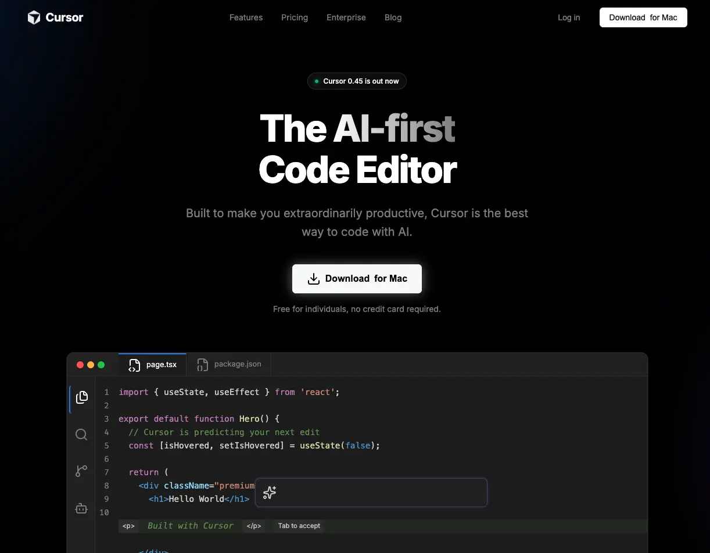

# Cursor Training Project



This project is a simple landing page for a cursor training program. It is built with HTML, CSS, and JavaScript.

## Agents

### Browser

Here are some useful prompts you can use with the `@Browser` agent in this project:

- `@Browser Open http://localhost:8000` : Opens the site in your default web browser (ensure the PHP server is running).
- `@Browser Review Design` : Review the current site design.

## Hooks

Cursor uses **hook scripts** to enhance safety, auditing, and automation during development. Hooks reside in `.cursor/hooks/` and must be executable. Make them so with:

```
chmod -R 777 .cursor/hooks
```

This project includes the following hooks:

- **before-shell.sh**  
  _When triggered:_ Right before any shell command is executed by the agent.  
  _Purpose:_ Blocks dangerous commands (e.g., `rm -rf /`).  
  _Behavior:_ If a risky command is detected, execution is prevented and a warning is shown:

  ```
  Blocked: dangerous command detected — 'rm -rf /'
  ```

- **on-edit.sh**  
  _When triggered:_ Immediately after the AI modifies a project file.  
  _Purpose:_ Logs all file edits made by the AI.  
  _Behavior:_ A log entry is written to `.cursor/logs/edits.log` in this format:

  ```
  [YYYY-MM-DD HH:MM:SS] edited: filename.ext (conversation: <id>)
  ```

- **on-stop.sh**  
  _When triggered:_ Whenever a Cursor agent task completes, fails, or is aborted.  
  _Purpose:_ Provides a task completion audit trail.  
  _Behavior:_ Records the event (including time and conversation ID) in `.cursor/logs/sessions.log`:
  ```
  [YYYY-MM-DD HH:MM:SS] task completed (conversation: <id>)
  ```
  _Extra:_ On macOS, a desktop notification appears summarizing the outcome (e.g., "Task Complete" or "Task Failed").

These hooks add safety, traceability, and clear feedback during collaboration with Cursor agents.

## Rules

The `.cursor/rules` directory contains project-specific conventions and documentation that guide AI and human contributors when editing the codebase. Each Markdown (`.mdc`) file describes standards for a particular aspect of the project, such as file structure, HTML best practices, CSS token usage, and JavaScript patterns.

Key points:

- **Always Applied Rules:** Some rules (like `file-structure.mdc` and `project-overview.mdc`) are always active, ensuring the project's global organization and stack are respected.
- **Targeted Conventions:** Other rule files only apply to matching file types (e.g., `*.css`, `*.html`, `*.js`) and explain how to format, structure, and style code in those files.
- **No Build Tools:** The rules enforce the project's vanilla HTML/CSS/JS stack—no frameworks, preprocessors, or bundlers are allowed.
- **Design Tokens & Utility Classes:** They specify how to use CSS custom properties and shared utility classes.
- **Icon Use & Markup:** Clear instructions are given for semantic structure and using Lucide icons correctly.

By following the guidelines in `.cursor/rules`, the codebase remains consistent, readable, and easy to maintain for both agents and humans.

NOTE :

- AGENTS.md is unecessary if your specificy project rules by files.

## Commands

The `.cursor/commands` directory houses reusable command and workflow definitions for Cursor. These Markdown (`.md`) files enable automation of common development tasks, enforce conventions, and streamline collaboration between humans and AI agents.

### What You'll Find in `.cursor/commands`:

Utils :

- `utils/open-browser.md`: Opens your site in your default browser.
- `utils/php-server.md`: Launches a local PHP server for simple development.
- and more

Workflows :

- `workflows/code-review-checklist.md`: Provides a full checklist for reviewing code changes.
- `workflows/create-issue.md`: Guides the creation of GitHub issues using standardized templates.
- `workflows/setup-new-feature.md`: Walks you through setting up a clean environment for implementing a new feature.
- and more

> **Sample:**  
> /workflows/create-issue create new issue in github current project, showing that the testimonial name should be changed to `Agung Sundoro`'

## Skills

The `.cursor/skills` directory contains agent "skills"—modular, task-focused behaviors that extend what Cursor AI can do within your project. Unlike rules (which passively constrain and shape edits), skills are **actively invoked** to accomplish well-defined actions, automations, or workflows.

- `/brainstorming` : brainstorming features or ideas for the app
- `/deploy` : deploy the site via SFTP

## Subagents

- `/security-auditor` : doing full project security audit
